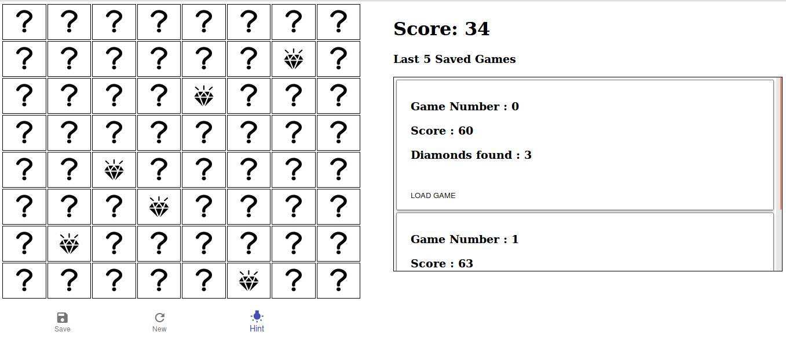

# Diamond Sweeper

## Requirements

* node.js (the app was built against v8.1.4, but any node > 6 should work)
* npm

## To start the Application:

* Install the dependencies (`npm install`)
* Start the webserver: `npm start`
* Visit `http://localhost:3000` to see the application

If you have done the above steps correctly, you should see the below

## To run tests:
* Run mocha : `npm test`

## Frameworks/Libraries used:
* JS : React.js, Facebook flux
* CSS : MaterialUI
* Bundler: webpack

## App features
* Play without hints (blanks on click)
* Play with hints (arrows shown)
* Save games (store in local storage)
* Load saved games
* Create new game
* Responsive
* Unit tests for critical logic
* Minified output available by bundling as `PROD_ENV=1 webpack`